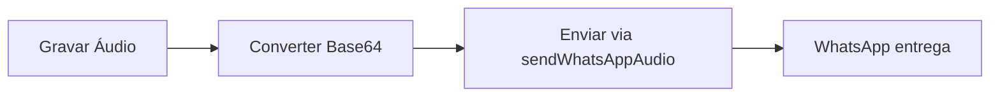
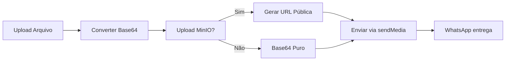

# 📱 Sistema de Mídia WhatsApp - Pandora Pro

## 🎯 Funcionalidades Principais

### ✅ **Upload e Envio de Mídia**
- [x] **Áudio**: Gravação em tempo real (OGG/Opus)
- [x] **Imagens**: Upload e visualização 
- [x] **Vídeos**: Upload com player integrado
- [x] **Documentos**: Suporte a PDF, DOC, XLS, etc.
- [x] **Limite de arquivo**: 30MB por arquivo

### ✅ **Storage Inteligente**
- [x] **MinIO S3**: Upload automático para storage externo
- [x] **URLs Públicas**: Envio por URL (mais eficiente que base64)
- [x] **Fallback Base64**: Compatibilidade quando MinIO indisponível
- [x] **Organização**: Pastas separadas por tipo de mídia
- [x] **Auto-Detecção**: Parsing inteligente de endpoints

### ✅ **Formatos Suportados**

#### 🎵 **Áudio (16MB máx)**
- **OGG** (.ogg) - audio/ogg (codec opus) ⭐ **Recomendado**
- **AAC** (.aac) - audio/aac
- **MP3** (.mp3) - audio/mpeg  
- **MP4 Audio** (.m4a) - audio/mp4
- **AMR** (.amr) - audio/amr

**📏 Requisitos Mínimos:**
- **Duração**: Mínimo 2 segundos
- **Tamanho**: Mínimo 2KB
- **Sample Rate**: 48kHz (recomendado)
- **Bitrate**: 64kbps para voz

#### 📸 **Imagem (5MB máx)**
- **JPEG** (.jpeg, .jpg) - image/jpeg
- **PNG** (.png) - image/png

#### 🎬 **Vídeo (16MB máx)**
- **MP4** (.mp4) - video/mp4
- **3GPP** (.3gp) - video/3gpp

#### 📄 **Documentos (100MB máx)**
- **PDF** (.pdf) - application/pdf
- **Word** (.doc, .docx) - application/msword
- **Excel** (.xls, .xlsx) - application/vnd.ms-excel
- **PowerPoint** (.ppt, .pptx) - application/vnd.ms-powerpoint
- **Texto** (.txt) - text/plain

### ✅ **Visualizador de Áudio Avançado**
- [x] **Player Interativo**: Play/pause, barra de progresso clicável
- [x] **Informações**: Nome do arquivo, duração, tempo atual
- [x] **Visual Responsivo**: Diferentes cores para mensagens enviadas/recebidas
- [x] **Suporte Base64**: Reproduz áudios salvos em base64
- [x] **Download**: Botão de download para URLs públicas
- [x] **Indicadores**: Loading, erro, progresso em tempo real
- [x] **Acessibilidade**: Controles intuitivos e feedback visual

## 🔧 Configuração MinIO

### **Variáveis de Ambiente**
```env
# MinIO (Object Storage)
# Formato 1: Endpoint com porta
MINIO_ENDPOINT=s3.marcussviniciusa.cloud:443
MINIO_ACCESS_KEY=sua_access_key
MINIO_SECRET_KEY=sua_secret_key
MINIO_BUCKET=pandora-files
MINIO_USE_SSL=true

# Formato 2: Endpoint com protocolo
MINIO_ENDPOINT=https://s3.amazonaws.com
MINIO_PORT=443

# Formato 3: IP local
MINIO_ENDPOINT=127.0.0.1:9000
MINIO_USE_SSL=false
```

### **Auto-Detecção de Configuração**
O sistema detecta automaticamente:
- **Protocolo**: `https://` → SSL habilitado
- **Porta**: `:443` → HTTPS, `:80` → HTTP, `:9000` → MinIO padrão
- **Endpoint**: Remove protocolos e extrai porta automaticamente

### **Estrutura de Pastas**
```
pandora-files/
├── whatsapp-audio/     # Arquivos de áudio
├── whatsapp-images/    # Imagens
├── whatsapp-videos/    # Vídeos  
└── whatsapp-documents/ # Documentos
```

## 🚀 Fluxo de Envio de Mídia

### **1. Áudio (Endpoint Específico)**


**Características:**
- ✅ Endpoint específico `/message/sendWhatsAppAudio/`
- ✅ Apenas base64 puro (sem prefixo)
- ✅ Otimizado para áudio
- ✅ Melhor compatibilidade

### **2. Outras Mídias (Método Inteligente)**


**Vantagens:**
- ✅ URLs para arquivos grandes
- ✅ Base64 como fallback
- ✅ Compatível com CDN

## 📊 API Evolution v2.2.3

### **Envio de Áudio (Endpoint Específico)**
```json
// POST /message/sendWhatsAppAudio/{instance}
{
  "number": "5584991516506",
  "audio": "T2dnUwACAAAAAAAAAABCOykN..." // base64 puro
}
```

### **Envio de Outras Mídias**

#### **Por URL (Recomendado)**
```json
// POST /message/sendMedia/{instance}
{
  "number": "5584991516506",
  "mediatype": "image",
  "mimetype": "image/jpeg",
  "media": "https://s3.exemplo.com/pandora-files/whatsapp-images/123456-image.jpg",
  "fileName": "foto.jpg",
  "caption": "Legenda da imagem"
}
```

#### **Por Base64 (Fallback)**
```json
// POST /message/sendMedia/{instance}
{
  "number": "5584991516506", 
  "mediatype": "image",
  "media": "/9j/4AAQSkZJRgABAQEAYABgAAD...", // base64 puro
  "fileName": "foto.jpg",
  "caption": "Legenda da imagem"
}
```

## 🎤 Gravação de Áudio

### **Configurações Otimizadas**
- **Formato**: OGG com codec Opus
- **Sample Rate**: 48kHz (padrão opus)
- **Bitrate**: 64kbps (voz)
- **Canais**: Mono
- **Duração mínima**: 1 segundo
- **Tamanho mínimo**: 1KB

### **Controles da Interface**
- 🎤 **Gravar**: Iniciar gravação
- ⏹️ **Parar**: Finalizar gravação
- ▶️ **Reproduzir**: Preview do áudio
- 🗑️ **Excluir**: Descartar gravação
- 📤 **Enviar**: Confirmar envio

## 🔍 Logs e Debugging

### **Storage MinIO**
```
💾 MinIO configurado - uploading arquivo...
📤 Uploading para MinIO: { bucket: "pandora-files", objectPath: "whatsapp-audio/123456-audio.ogg" }
✅ Upload para MinIO bem-sucedido: { url: "https://..." }
```

### **Envio Evolution API**
```
🔄 Evolution API - Enviando mídia: { isUrl: true, hasMimeType: true }
📡 Evolution API Response: { status: 201, messageType: "audioMessage" }
```

### **Fallback Base64**
```
⚠️ Falha no upload para MinIO, usando base64 como fallback
📝 MinIO não configurado - usando base64
```

## 🧪 Testes

### **Endpoint de Teste MinIO**
```bash
GET /api/whatsapp/storage-test
```

**Resposta de Sucesso:**
```json
{
  "configured": true,
  "connected": true,
  "message": "MinIO conectado e funcionando!",
  "endpoint": "s3.exemplo.com:443",
  "bucket": "pandora-files",
  "useSSL": true
}
```

## 🔧 Troubleshooting

### **Problemas Comuns**

#### ❌ **Áudio não chega ao destinatário**
1. Verificar formato (deve ser OGG/Opus)
2. Confirmar tamanho mínimo (>1KB)
3. Testar MinIO se configurado
4. Verificar logs da Evolution API

#### ❌ **MinIO não conecta**
1. Verificar variáveis de ambiente
2. Testar endpoint via navegador
3. Confirmar credenciais
4. Verificar conectividade de rede

#### ❌ **Upload falha**
1. Verificar tamanho do arquivo (<30MB)
2. Confirmar formato suportado
3. Testar conexão MinIO
4. Verificar logs do servidor

## 📈 Melhorias Futuras

### **Em Desenvolvimento**
- [ ] **Compressão automática**: Reduzir tamanho de arquivos
- [ ] **CDN Integration**: Cache distribuído
- [ ] **Limpeza automática**: Remoção de arquivos antigos
- [ ] **Estatísticas**: Uso de storage e bandwidth

### **Planejado**
- [ ] **Suporte a GIFs**: Animações
- [ ] **Stickers**: Figurinhas personalizadas
- [ ] **Upload múltiplo**: Vários arquivos de uma vez
- [ ] **Preview avançado**: Metadados de mídia 