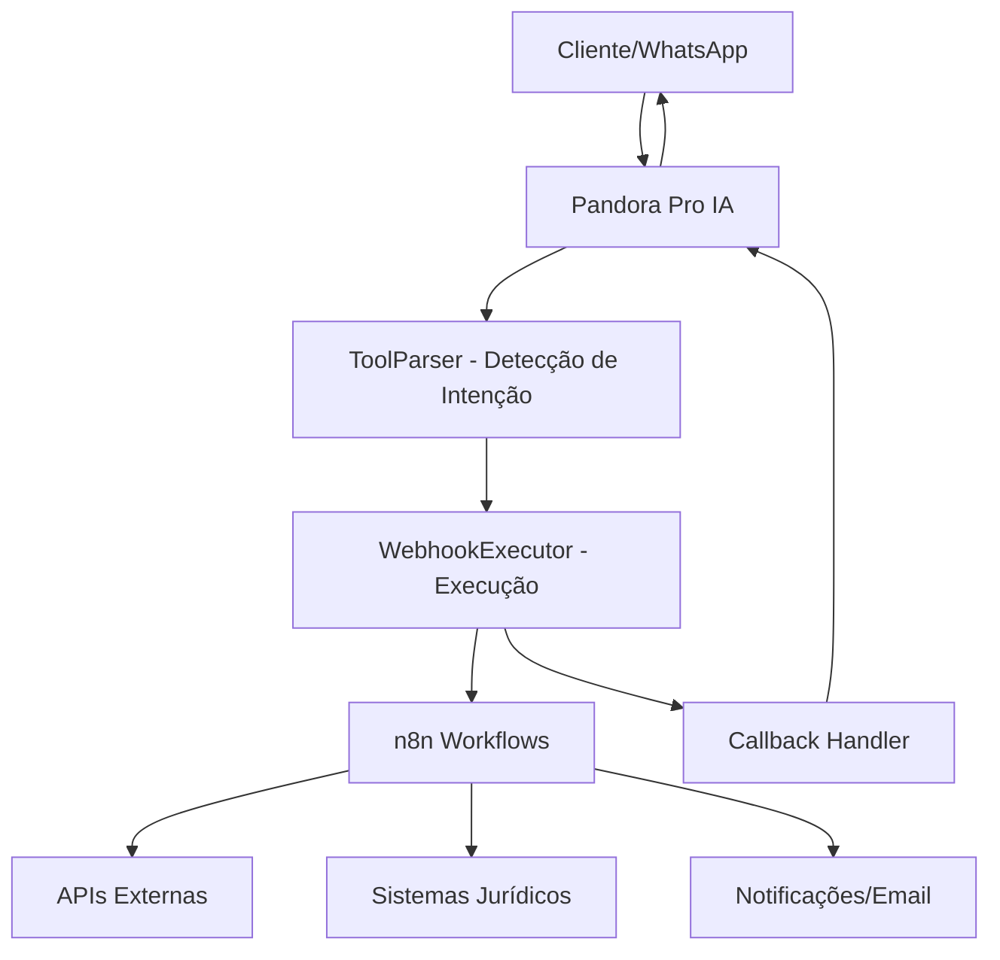
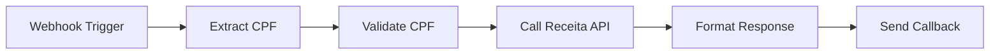
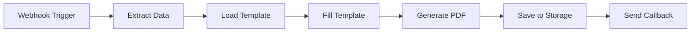
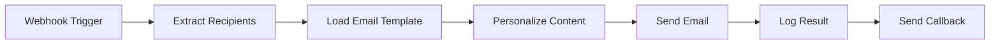

# 📋 Documentação Completa do Sistema Tools/Webhooks - Pandora Pro

## 🎯 Visão Geral

O Sistema Tools/Webhooks transforma o Pandora Pro de um simples chatbot em uma **plataforma de automação jurídica inteligente**. Permite que a IA execute ações reais no mundo através de integrações com n8n, criando um ecossistema onde conversas se transformam em automações.

### 🏗️ Arquitetura do Sistema



## 📁 Estrutura de Arquivos

```
src/
├── lib/
│   ├── ai/
│   │   └── tool-parser.ts          # Detecta solicitações de ação
│   └── webhook/
│       └── executor.ts             # Executa webhooks e processa callbacks
├── app/
│   ├── api/
│   │   ├── tools/
│   │   │   ├── route.ts           # CRUD de tools
│   │   │   └── [id]/route.ts      # Operações específicas por tool
│   │   └── webhooks/
│   │       └── callback/route.ts   # Recebe callbacks do n8n
│   └── admin/
│       └── tools/
│           ├── page.tsx           # Interface administrativa
│           └── components/
│               ├── CreateToolDialog.tsx
│               └── EditToolDialog.tsx
└── types/
    └── tools.ts                   # Definições TypeScript
```

## 🤖 ToolParser - Inteligência de Detecção

### Funcionalidade Principal
O `ToolParser` é o cérebro que analisa mensagens dos usuários e detecta quando uma automação deve ser executada.

### Algoritmo de Detecção

#### 1. Padrões de Ação (Regex)
```typescript
const actionPatterns = [
  // Verbos diretos
  /(?:execute|executar|fazer|realizar|processar|consultar|buscar|verificar|gerar|criar)\s+(.+)/i,
  
  // Solicitações educadas  
  /(?:preciso que você|você pode|pode|você poderia|seria possível)\s+(.+)/i,
  
  // Pedidos formais
  /(?:solicito|peço|gostaria|necessito)\s+(.+)/i,
  
  // Comandos imperativos
  /(?:me ajude a|ajude-me a|quero que você)\s+(.+)/i,
  
  // Perguntas de ação
  /(?:como faço para|como posso|onde posso)\s+(.+)/i
]
```

#### 2. Algoritmo de Similaridade (Jaccard + Bonifcações)
```typescript
// Calcula similaridade entre descrição da mensagem e tool
private static calculateSimilarity(text1: string, text2: string): number {
  const normalize = (text: string) => 
    text.toLowerCase()
        .replace(/[^\w\s]/g, '')
        .split(/\s+/)
        .filter(word => word.length > 2)

  const words1 = normalize(text1)
  const words2 = normalize(text2)
  
  // Jaccard similarity
  const intersection = words1.filter(word => words2.includes(word))
  const union = [...new Set([...words1, ...words2])]
  let similarity = intersection.length / union.length

  // Bonus para termos importantes
  const importantTerms = ['cpf', 'cnpj', 'documento', 'consulta', 'gerar', 'calcular']
  const exactMatches = importantTerms.filter(term => 
    text1.toLowerCase().includes(term) && text2.toLowerCase().includes(term)
  )
  
  similarity += exactMatches.length * 0.1 // 10% bonus
  return Math.min(similarity, 1.0)
}
```

#### 3. Mapeamento Contextual
```typescript
const keywordMappings = [
  {
    keywords: ['cpf', 'documento', 'consulta cpf', 'validar cpf'],
    weight: 0.8
  },
  {
    keywords: ['cnpj', 'empresa', 'consulta cnpj', 'validar cnpj'],
    weight: 0.8
  },
  {
    keywords: ['documento', 'gerar documento', 'pdf', 'contrato'],
    weight: 0.7
  },
  {
    keywords: ['email', 'enviar email', 'notificação'],
    weight: 0.6
  }
]
```

### Uso no Código
```typescript
import { ToolParser } from '@/lib/ai/tool-parser'

// Detectar tools a partir de uma mensagem
const toolCalls = ToolParser.detectToolCalls(message, availableTools)

// Debug de detecção
const analysis = ToolParser.analyzeMessage(message, availableTools)
console.log('Padrões detectados:', analysis.detectedPatterns)
console.log('Scores das tools:', analysis.toolScores)
```

## ⚡ WebhookExecutor - Motor de Execução

### Funcionalidade Principal
O `WebhookExecutor` é responsável por executar as automações, gerenciar callbacks e controlar o ciclo de vida das execuções.

### Fluxo de Execução

#### 1. Execução Inicial
```typescript
const result = await WebhookExecutor.executeWebhook(
  tool,           // Tool a ser executada
  description,    // Descrição da ação solicitada
  requestId,      // ID único da requisição
  conversationId, // ID da conversa (opcional)
  agentId         // ID do agente IA (opcional)
)
```

#### 2. Payload Enviado para n8n
```typescript
interface WebhookPayload {
  description: string    // "consultar CPF 123.456.789-00"
  requestId: string      // "req_1234567890_abc123def"
  timestamp: string      // "2024-01-15T10:30:00.000Z"
  metadata: {
    toolName: string     // "Consulta CPF"
    executionId: string  // UUID da execução no banco
    officeId: string     // ID do escritório
  }
}
```

#### 3. Headers de Segurança
```typescript
const headers = {
  'Content-Type': 'application/json',
  'User-Agent': 'PandoraPro/1.0',
  'X-Pandora-Request-ID': requestId,
  'X-Pandora-Tool-ID': tool.id
}
```

### Estados de Execução

| Estado | Descrição | Quando Ocorre |
|--------|-----------|---------------|
| `PENDING` | Aguardando conclusão | Inicial, após envio para n8n |
| `SUCCESS` | Concluída com sucesso | Callback ou resposta síncrona positiva |
| `ERROR` | Falha na execução | Erro HTTP, lógica ou dados |
| `TIMEOUT` | Tempo limite excedido | Sem resposta em 30 segundos |

### Tratamento de Callbacks

#### Endpoint de Callback
```typescript
// POST /api/webhooks/callback
{
  "requestId": "req_1234567890_abc123def",
  "success": true,
  "result": {
    "cpf": "123.456.789-00",
    "nome": "João Silva",
    "situacao": "Regular"
  },
  "error": null
}
```

#### Processamento do Callback
```typescript
const callbackResult = await WebhookExecutor.handleCallback(
  requestId,  // ID da requisição original
  success,    // true/false
  result,     // Dados retornados
  error       // Mensagem de erro (opcional)
)
```

### Sistema de Retry
```typescript
// Retry automático para execuções que falharam
const retryResult = await WebhookExecutor.retryExecution(executionId)

// Configurações de retry
- Máximo: 3 tentativas
- Intervalo: Exponencial (1s, 2s, 4s)
- Condições: Erros de rede ou timeout
```

## 🗄️ Schema do Banco de Dados

### Tabela: Tool
```sql
CREATE TABLE Tool (
  id          String   PRIMARY KEY
  name        String   NOT NULL              -- "Consulta CPF"
  description String   NOT NULL              -- "Consulta dados de CPF via Receita Federal"
  webhookUrl  String   NOT NULL              -- "https://n8n.escritorio.com/webhook/cpf"
  isActive    Boolean  DEFAULT true          -- Tool ativa/inativa
  officeId    String   NOT NULL              -- Referência ao escritório
  createdById String   NOT NULL              -- Quem criou a tool
  createdAt   DateTime DEFAULT now()
  updatedAt   DateTime DEFAULT now()
)
```

### Tabela: ToolExecution
```sql
CREATE TABLE ToolExecution (
  id             String                    PRIMARY KEY
  toolId         String                    NOT NULL    -- Referência à Tool
  requestId      String                    UNIQUE      -- ID único da requisição
  description    String                    NOT NULL    -- "consultar CPF 123.456.789-00"
  status         ToolExecutionStatus       NOT NULL    -- PENDING|SUCCESS|ERROR|TIMEOUT
  conversationId String?                               -- ID da conversa (opcional)
  agentId        String?                               -- ID do agente IA (opcional)
  startedAt      DateTime                  DEFAULT now()
  completedAt    DateTime?                             -- Quando foi concluída
  requestData    Json?                                 -- Dados enviados para webhook
  responseData   Json?                                 -- Dados recebidos do callback
  errorMessage   String?                               -- Mensagem de erro
  retryCount     Int                       DEFAULT 0   -- Número de tentativas
)
```

## 🎨 Interface Administrativa

### Página Principal: `/admin/tools`

#### Componentes da Interface
1. **Dashboard de Estatísticas**
   - Total de tools ativas/inativas
   - Execuções nas últimas 24h
   - Taxa de sucesso
   - Tempo médio de execução

2. **Lista de Tools**
   - Cards com informações da tool
   - Status (Ativa/Inativa)
   - Ações (Editar, Deletar, Toggle Status)
   - Contador de execuções

3. **Diálogos de Criação/Edição**
   - Formulário de criação de nova tool
   - Validação de URL webhook
   - Teste de conectividade

### Componente: CreateToolDialog
```typescript
interface CreateToolForm {
  name: string        // Nome da tool
  description: string // Descrição detalhada
  webhookUrl: string  // URL do webhook n8n
}

// Validação com Zod
const createToolSchema = z.object({
  name: z.string().min(1, 'Nome é obrigatório'),
  description: z.string().min(10, 'Descrição deve ter pelo menos 10 caracteres'),
  webhookUrl: z.string().url('URL inválida'),
})
```

### Componente: EditToolDialog
- Permite editar tool existente
- Mantém histórico de execuções
- Opção de ativar/desativar
- Teste de conectividade do webhook

## 🔌 APIs REST

### GET /api/tools
**Buscar todas as tools do escritório**

```typescript
// Response
{
  "tools": [
    {
      "id": "tool_123",
      "name": "Consulta CPF",
      "description": "Consulta dados de CPF via Receita Federal",
      "webhookUrl": "https://n8n.escritorio.com/webhook/cpf",
      "isActive": true,
      "createdAt": "2024-01-15T10:00:00.000Z",
      "createdBy": {
        "name": "Admin User",
        "email": "admin@escritorio.com"
      },
      "_count": {
        "executions": 45
      }
    }
  ]
}
```

### POST /api/tools
**Criar nova tool**

```typescript
// Request
{
  "name": "Consulta CNPJ",
  "description": "Consulta dados de CNPJ via Receita Federal",
  "webhookUrl": "https://n8n.escritorio.com/webhook/cnpj"
}

// Response
{
  "tool": { /* Tool criada */ }
}
```

### PUT /api/tools/[id]
**Atualizar tool existente**

```typescript
// Request
{
  "name": "Novo Nome",
  "description": "Nova descrição",
  "webhookUrl": "https://nova-url.com/webhook",
  "isActive": false
}
```

### DELETE /api/tools/[id]
**Deletar tool**

```typescript
// Response
{
  "message": "Tool deletada com sucesso"
}
```

### GET /api/tools/[id]/executions
**Buscar execuções de uma tool**

```typescript
// Response
{
  "executions": [
    {
      "id": "exec_123",
      "requestId": "req_1234567890_abc123def",
      "description": "consultar CPF 123.456.789-00",
      "status": "SUCCESS",
      "startedAt": "2024-01-15T10:30:00.000Z",
      "completedAt": "2024-01-15T10:30:02.000Z",
      "responseData": {
        "cpf": "123.456.789-00",
        "nome": "João Silva",
        "situacao": "Regular"
      }
    }
  ]
}
```

### POST /api/webhooks/callback
**Receber callback do n8n**

```typescript
// Request
{
  "requestId": "req_1234567890_abc123def",
  "success": true,
  "result": {
    "cpf": "123.456.789-00",
    "nome": "João Silva",
    "situacao": "Regular"
  }
}

// Response
{
  "message": "Callback processado com sucesso",
  "executionId": "exec_123"
}
```

## 🔄 Integração com n8n

### Configuração do Workflow n8n

#### 1. Webhook Trigger Node
```json
{
  "httpMethod": "POST",
  "path": "/webhook/cpf",
  "responseMode": "onReceived"
}
```

#### 2. Processamento dos Dados
```javascript
// Extrair dados do payload
const { description, requestId, metadata } = $input.all()[0].json

// Processar a descrição para extrair CPF
const cpfMatch = description.match(/(\d{3}\.?\d{3}\.?\d{3}-?\d{2})/)
const cpf = cpfMatch ? cpfMatch[1] : null
```

#### 3. Chamada para API Externa
```javascript
// Consultar API da Receita Federal
const response = await fetch(`https://api.receita.com/cpf/${cpf}`, {
  headers: { 'Authorization': 'Bearer TOKEN' }
})
const data = await response.json()
```

#### 4. Callback para Pandora Pro
```javascript
// Enviar resultado de volta
await fetch('https://pandora.escritorio.com/api/webhooks/callback', {
  method: 'POST',
  headers: { 'Content-Type': 'application/json' },
  body: JSON.stringify({
    requestId: requestId,
    success: response.ok,
    result: data,
    error: response.ok ? null : 'Erro na consulta'
  })
})
```

### Exemplos de Workflows

#### 1. Consulta CPF


#### 2. Geração de Documento


#### 3. Envio de Email


## 🔒 Segurança e Validação

### Autenticação
- Middleware verifica token JWT
- Apenas ADMIN e SUPER_ADMIN podem criar/editar tools
- Tools isoladas por escritório (officeId)

### Validação de URLs
```typescript
// Validação de webhook URL
const createToolSchema = z.object({
  webhookUrl: z.string().url('URL inválida')
    .refine(url => url.startsWith('https://'), 'URL deve usar HTTPS')
    .refine(url => !url.includes('localhost'), 'URLs localhost não permitidas em produção')
})
```

### Headers de Segurança
```typescript
const securityHeaders = {
  'User-Agent': 'PandoraPro/1.0',
  'X-Pandora-Request-ID': requestId,
  'X-Pandora-Tool-ID': tool.id,
  'X-Pandora-Office-ID': tool.officeId
}
```

### Rate Limiting
- Máximo 10 execuções por minuto por tool
- Máximo 100 execuções por hora por escritório
- Timeout de 30 segundos por execução

## 📊 Monitoramento e Analytics

### Métricas Disponíveis

#### 1. Estatísticas Gerais
```typescript
interface ToolStats {
  totalTools: number
  activeTools: number
  totalExecutions: number
  successRate: number
  averageExecutionTime: number
}
```

#### 2. Métricas por Tool
```typescript
interface ToolMetrics {
  toolId: string
  toolName: string
  executionCount: number
  successCount: number
  errorCount: number
  averageExecutionTime: number
  lastExecution: Date
}
```

#### 3. Trending de Execuções
- Execuções por hora/dia/semana
- Picos de uso
- Ferramentas mais utilizadas
- Taxa de erro ao longo do tempo

### Dashboard de Monitoramento
- Gráficos de execuções em tempo real
- Status de saúde das tools
- Logs de erro detalhados
- Alertas para falhas recorrentes

## 🎯 Casos de Uso Implementados

### 1. Consulta de CPF
**Entrada:** "Preciso consultar o CPF 123.456.789-00"
**Fluxo:**
1. ToolParser detecta padrão de consulta
2. WebhookExecutor envia para n8n
3. n8n consulta API da Receita Federal
4. Callback retorna dados do contribuinte
5. IA apresenta resultado formatado

### 2. Geração de Documento
**Entrada:** "Gere um contrato de prestação de serviços para João Silva"
**Fluxo:**
1. ToolParser identifica geração de documento
2. WebhookExecutor envia dados do cliente
3. n8n carrega template e preenche dados
4. PDF é gerado e salvo
5. Callback retorna link do documento

### 3. Envio de Notificação
**Entrada:** "Envie um email para o cliente sobre o andamento do processo"
**Fluxo:**
1. ToolParser detecta solicitação de email
2. WebhookExecutor envia contexto
3. n8n monta email personalizado
4. Email é enviado via SMTP
5. Callback confirma envio

### 4. Cálculo Previdenciário
**Entrada:** "Calcule o valor da aposentadoria para salário de R$ 5.000"
**Fluxo:**
1. ToolParser identifica cálculo
2. WebhookExecutor envia parâmetros
3. n8n executa fórmulas previdenciárias
4. Resultado é calculado e formatado
5. Callback retorna valores e explicação

## 🚀 Próximas Evoluções

### 1. Sistema de Templates
- Templates predefinidos para tools comuns
- Marketplace de automações jurídicas
- Importação/exportação de workflows

### 2. Inteligência Avançada
- Machine Learning para melhor detecção
- Aprendizado contínuo das preferências
- Sugestão automática de melhorias

### 3. Integração Avançada
- Webhook bidirecional em tempo real
- Streaming de dados para execuções longas
- Sistema de pub/sub para notificações

### 4. Analytics Avançado
- Dashboard executivo com KPIs
- Relatórios de ROI das automações
- Comparativo de performance

## 🛠️ Manutenção e Troubleshooting

### Logs de Sistema
```typescript
// Logs automáticos gerados
console.log(`🔧 Executando tool "${tool.name}" - RequestID: ${requestId}`)
console.log(`✅ Tool executada com sucesso - Status: ${response.status}`)
console.error(`❌ Erro ao executar tool "${tool.name}":`, error)
console.warn(`⚠️ Callback recebido para requestId inexistente: ${requestId}`)
```

### Comandos de Debug
```typescript
// Analisar detecção de mensagem
const analysis = ToolParser.analyzeMessage(message, tools)

// Verificar execuções em timeout
const timedOut = await WebhookExecutor.getExecutionsWithTimeout(5)

// Estatísticas de performance
const stats = await WebhookExecutor.getExecutionStats(officeId, 30)
```

### Problemas Comuns

#### 1. Tool não é detectada
- Verificar se a descrição da tool é específica
- Ajustar keywords na mensagem
- Verificar se a tool está ativa

#### 2. Webhook falha
- Verificar conectividade com n8n
- Validar formato do payload
- Verificar logs de erro no n8n

#### 3. Callback não recebido
- Verificar se o requestId está correto
- Validar URL de callback no n8n
- Verificar timeout da execução

---

## 🎉 Conclusão

O Sistema Tools/Webhooks do Pandora Pro representa uma evolução significativa na automação jurídica, transformando conversas em ações concretas. Com arquitetura robusta, segurança avançada e interface intuitiva, oferece uma base sólida para expandir as capacidades da IA jurídica.

**Status:** ✅ **100% Implementado e Funcionando**  
**Próximo passo:** Integração WhatsApp para atendimento automatizado em massa 