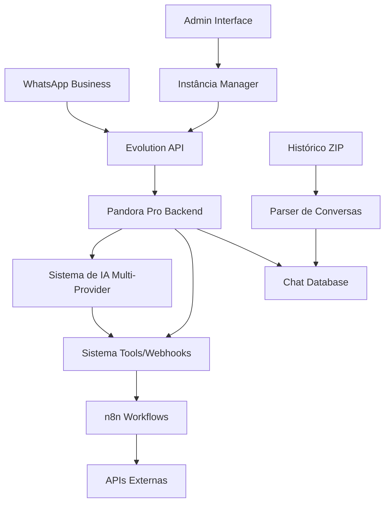

# 📱 Planejamento Completo - Integração WhatsApp + Evolution API

## 🎯 Visão Geral

Implementar integração completa com WhatsApp usando Evolution API, permitindo:
1. **Conexão via QR Code** - Admin cria instância e conecta
2. **Recebimento e envio** de mensagens em tempo real
3. **Importação de histórico** - Upload de arquivo ZIP exportado do WhatsApp
4. **Integração com IA** - Respostas automáticas usando sistema atual
5. **Sistema de Tools/Webhooks** - Automações executadas via WhatsApp

## 🏗️ Arquitetura da Solução



## 📋 Schema do Banco de Dados

### 1. Instâncias WhatsApp
```sql
CREATE TABLE WhatsAppInstance (
  id              String    PRIMARY KEY
  name            String    NOT NULL           -- Nome da instância
  phoneNumber     String?                      -- Número conectado
  status          String    NOT NULL           -- connected, disconnected, connecting
  qrCode          String?                      -- Base64 do QR Code atual
  webhookUrl      String?                      -- URL para receber webhooks
  officeId        String    NOT NULL           -- Referência ao escritório
  createdById     String    NOT NULL           -- Admin que criou
  connectionData  Json?                        -- Dados de conexão da Evolution API
  isActive        Boolean   DEFAULT true       -- Instância ativa/inativa
  createdAt       DateTime  DEFAULT now()
  updatedAt       DateTime  DEFAULT now()
)
```

### 2. Contatos WhatsApp
```sql
CREATE TABLE WhatsAppContact (
  id              String    PRIMARY KEY
  instanceId      String    NOT NULL           -- Referência à instância
  remoteJid       String    NOT NULL           -- JID do contato no WhatsApp
  phoneNumber     String    NOT NULL           -- Número de telefone
  name            String?                      -- Nome do contato
  pushName        String?                      -- Nome exibido no WhatsApp
  profilePicUrl   String?                      -- URL da foto do perfil
  isGroup         Boolean   DEFAULT false      -- Se é um grupo
  lastSeen        DateTime?                    -- Última vez visto online
  isBlocked       Boolean   DEFAULT false      -- Se está bloqueado
  clientId        String?                      -- Referência ao cliente (se existir)
  tags            String[]  DEFAULT []         -- Tags personalizadas
  notes           String?                      -- Observações do atendente
  createdAt       DateTime  DEFAULT now()
  updatedAt       DateTime  DEFAULT now()
  
  @@unique([instanceId, remoteJid])
)
```

### 3. Conversas WhatsApp
```sql
CREATE TABLE WhatsAppConversation (
  id              String    PRIMARY KEY
  instanceId      String    NOT NULL           -- Referência à instância
  contactId       String    NOT NULL           -- Referência ao contato
  remoteJid       String    NOT NULL           -- JID da conversa
  title           String?                      -- Título da conversa (para grupos)
  isGroup         Boolean   DEFAULT false      -- Se é conversa em grupo
  lastMessageId   String?                      -- ID da última mensagem
  lastMessageAt   DateTime?                    -- Timestamp da última mensagem
  unreadCount     Int       DEFAULT 0          -- Mensagens não lidas
  isArchived      Boolean   DEFAULT false      -- Se está arquivada
  isPinned        Boolean   DEFAULT false      -- Se está fixada
  assignedUserId  String?                      -- Usuário responsável pelo atendimento
  status          String    DEFAULT 'open'     -- open, closed, pending
  aiEnabled       Boolean   DEFAULT true       -- Se IA está habilitada
  currentAgentId  String?                      -- Agente IA atual
  metadata        Json?                        -- Dados adicionais
  createdAt       DateTime  DEFAULT now()
  updatedAt       DateTime  DEFAULT now()
  
  @@unique([instanceId, remoteJid])
)
```

### 4. Mensagens WhatsApp
```sql
CREATE TABLE WhatsAppMessage (
  id              String    PRIMARY KEY
  instanceId      String    NOT NULL           -- Referência à instância
  conversationId  String    NOT NULL           -- Referência à conversa
  contactId       String    NOT NULL           -- Referência ao contato
  remoteJid       String    NOT NULL           -- JID do remetente
  messageId       String    NOT NULL           -- ID único da mensagem no WhatsApp
  fromMe          Boolean   NOT NULL           -- Se foi enviada por nós
  messageType     String    NOT NULL           -- text, image, audio, video, document, location, sticker
  content         String?                      -- Conteúdo textual
  quotedMessageId String?                      -- ID da mensagem citada
  mediaUrl        String?                      -- URL do arquivo de mídia
  mediaSize       Int?                         -- Tamanho do arquivo em bytes
  mimetype        String?                      -- Tipo MIME do arquivo
  fileName        String?                      -- Nome do arquivo
  caption         String?                      -- Legenda da mídia
  location        Json?                        -- Dados de localização
  isForwarded     Boolean   DEFAULT false      -- Se é uma mensagem encaminhada
  timestamp       DateTime  NOT NULL           -- Timestamp da mensagem
  status          String    DEFAULT 'sent'     -- sent, delivered, read, failed
  isDeleted       Boolean   DEFAULT false      -- Se foi deletada
  isEdited        Boolean   DEFAULT false      -- Se foi editada
  aiResponse      Boolean   DEFAULT false      -- Se foi resposta da IA
  toolExecution   String?                      -- ID de execução de tool (se aplicável)
  importedFrom    String?                      -- 'whatsapp_export' se importada
  createdAt       DateTime  DEFAULT now()
  updatedAt       DateTime  DEFAULT now()
  
  @@unique([instanceId, messageId])
)
```

### 5. Importações de Histórico
```sql
CREATE TABLE WhatsAppImport (
  id              String    PRIMARY KEY
  instanceId      String    NOT NULL           -- Referência à instância
  contactId       String    NOT NULL           -- Contato importado
  fileName        String    NOT NULL           -- Nome do arquivo ZIP
  fileSize        Int       NOT NULL           -- Tamanho do arquivo
  totalMessages   Int       DEFAULT 0          -- Total de mensagens no arquivo
  importedMessages Int      DEFAULT 0          -- Mensagens importadas com sucesso
  failedMessages  Int       DEFAULT 0          -- Mensagens que falharam
  mediaFiles      String[]  DEFAULT []         -- Lista de arquivos de mídia
  status          String    DEFAULT 'pending'  -- pending, processing, completed, failed
  errorMessage    String?                      -- Mensagem de erro (se houver)
  uploadedById    String    NOT NULL           -- Usuário que fez upload
  importedAt      DateTime?                    -- Quando foi concluída
  createdAt       DateTime  DEFAULT now()
  updatedAt       DateTime  DEFAULT now()
)
```

## 🔌 APIs da Evolution API

### 1. Gerenciamento de Instâncias

#### Criar Instância
```typescript
// POST /api/whatsapp/instances
interface CreateInstanceRequest {
  name: string
  webhookUrl?: string
}

interface CreateInstanceResponse {
  instanceName: string
  qrCode?: string
  status: 'connecting' | 'connected' | 'disconnected'
}
```

#### Conectar via QR Code
```typescript
// GET /api/whatsapp/instances/:instanceId/qr
interface QRCodeResponse {
  qrCode: string  // Base64 image
  status: string
}
```

#### Status da Instância
```typescript
// GET /api/whatsapp/instances/:instanceId/status
interface InstanceStatus {
  instanceName: string
  status: 'connecting' | 'connected' | 'disconnected'
  phoneNumber?: string
  profileName?: string
  profilePicture?: string
}
```

### 2. Envio de Mensagens

#### Enviar Mensagem de Texto
```typescript
// POST /api/whatsapp/instances/:instanceId/send/text
interface SendTextRequest {
  remoteJid: string
  message: string
  quotedMessageId?: string
}
```

#### Enviar Mídia
```typescript
// POST /api/whatsapp/instances/:instanceId/send/media
interface SendMediaRequest {
  remoteJid: string
  mediaUrl: string
  caption?: string
  mimetype: string
}
```

### 3. Webhooks da Evolution API

#### Recebimento de Mensagens
```typescript
// POST /api/webhooks/whatsapp/message
interface MessageWebhook {
  instance: string
  data: {
    key: {
      remoteJid: string
      fromMe: boolean
      id: string
    }
    pushName: string
    message: {
      conversation?: string
      imageMessage?: {
        url: string
        mimetype: string
        caption?: string
      }
      audioMessage?: {
        url: string
        mimetype: string
      }
      videoMessage?: {
        url: string
        mimetype: string
        caption?: string
      }
      documentMessage?: {
        url: string
        mimetype: string
        fileName: string
      }
      locationMessage?: {
        degreesLatitude: number
        degreesLongitude: number
        name?: string
      }
    }
    messageType: string
    messageTimestamp: number
  }
}
```

#### Status de Conexão
```typescript
// POST /api/webhooks/whatsapp/connection
interface ConnectionWebhook {
  instance: string
  data: {
    state: 'connecting' | 'open' | 'close'
    statusReason?: number
  }
}
```

## 🔧 Implementação Backend

### 1. Evolution API Client
```typescript
// src/lib/evolution-api/client.ts
export class EvolutionAPIClient {
  private baseUrl: string
  private apiKey: string

  constructor(baseUrl: string, apiKey: string) {
    this.baseUrl = baseUrl
    this.apiKey = apiKey
  }

  // Criar instância
  async createInstance(data: CreateInstanceRequest): Promise<CreateInstanceResponse> {
    const response = await fetch(`${this.baseUrl}/instance/create`, {
      method: 'POST',
      headers: {
        'Content-Type': 'application/json',
        'Authorization': `Bearer ${this.apiKey}`
      },
      body: JSON.stringify({
        instanceName: data.name,
        qrcode: true,
        integration: 'WHATSAPP-BAILEYS'
      })
    })
    return response.json()
  }

  // Buscar QR Code
  async getQRCode(instanceName: string): Promise<QRCodeResponse> {
    const response = await fetch(`${this.baseUrl}/instance/connect/${instanceName}`)
    return response.json()
  }

  // Enviar mensagem
  async sendTextMessage(instanceName: string, data: SendTextRequest) {
    return fetch(`${this.baseUrl}/message/sendText/${instanceName}`, {
      method: 'POST',
      headers: {
        'Content-Type': 'application/json',
        'Authorization': `Bearer ${this.apiKey}`
      },
      body: JSON.stringify({
        number: data.remoteJid,
        text: data.message
      })
    })
  }

  // Configurar webhook
  async setWebhook(instanceName: string, webhookUrl: string) {
    return fetch(`${this.baseUrl}/webhook/set/${instanceName}`, {
      method: 'POST',
      headers: {
        'Content-Type': 'application/json',
        'Authorization': `Bearer ${this.apiKey}`
      },
      body: JSON.stringify({
        url: webhookUrl,
        events: [
          'MESSAGES_UPSERT',
          'MESSAGES_UPDATE',
          'CONNECTION_UPDATE',
          'QRCODE_UPDATED'
        ]
      })
    })
  }
}
```

### 2. WhatsApp Service
```typescript
// src/lib/whatsapp/service.ts
export class WhatsAppService {
  private evolutionAPI: EvolutionAPIClient
  
  constructor() {
    this.evolutionAPI = new EvolutionAPIClient(
      process.env.EVOLUTION_API_URL!,
      process.env.EVOLUTION_API_KEY!
    )
  }

  // Criar nova instância
  async createInstance(data: {
    name: string
    officeId: string
    createdById: string
  }) {
    // 1. Criar instância na Evolution API
    const evolutionResponse = await this.evolutionAPI.createInstance({
      name: data.name,
      webhookUrl: `${process.env.APP_URL}/api/webhooks/whatsapp/message`
    })

    // 2. Salvar no banco
    const instance = await prisma.whatsAppInstance.create({
      data: {
        id: generateId(),
        name: data.name,
        status: 'connecting',
        qrCode: evolutionResponse.qrCode,
        officeId: data.officeId,
        createdById: data.createdById,
        connectionData: evolutionResponse
      }
    })

    // 3. Configurar webhook
    await this.evolutionAPI.setWebhook(
      data.name, 
      `${process.env.APP_URL}/api/webhooks/whatsapp/${instance.id}`
    )

    return instance
  }

  // Processar webhook de mensagem recebida
  async handleIncomingMessage(webhook: MessageWebhook) {
    const instance = await prisma.whatsAppInstance.findFirst({
      where: { name: webhook.instance }
    })

    if (!instance) return

    // 1. Criar/atualizar contato
    const contact = await this.upsertContact({
      instanceId: instance.id,
      remoteJid: webhook.data.key.remoteJid,
      pushName: webhook.data.pushName
    })

    // 2. Criar/atualizar conversa
    const conversation = await this.upsertConversation({
      instanceId: instance.id,
      contactId: contact.id,
      remoteJid: webhook.data.key.remoteJid
    })

    // 3. Salvar mensagem
    const message = await this.saveMessage({
      instanceId: instance.id,
      conversationId: conversation.id,
      contactId: contact.id,
      webhookData: webhook.data
    })

    // 4. Processar com IA (se habilitado)
    if (conversation.aiEnabled && !webhook.data.key.fromMe) {
      await this.processWithAI(conversation, message)
    }
  }

  // Processar mensagem com IA
  async processWithAI(conversation: WhatsAppConversation, message: WhatsAppMessage) {
    try {
      // 1. Buscar histórico da conversa
      const history = await this.getConversationHistory(conversation.id)
      
      // 2. Detectar tools (usando sistema existente)
      const availableTools = await prisma.tool.findMany({
        where: { 
          officeId: conversation.instance.officeId,
          isActive: true 
        }
      })
      
      const toolCalls = ToolParser.detectToolCalls(message.content || '', availableTools)
      
      // 3. Se detectou tool, executar
      if (toolCalls.length > 0) {
        for (const toolCall of toolCalls) {
          await WebhookExecutor.executeWebhook(
            toolCall.tool,
            toolCall.description,
            toolCall.requestId,
            conversation.id,
            conversation.currentAgentId
          )
        }
        return
      }

      // 4. Caso contrário, gerar resposta com IA
      const aiResponse = await this.generateAIResponse(conversation, message, history)
      
      // 5. Enviar resposta
      if (aiResponse) {
        await this.sendMessage({
          instanceId: conversation.instanceId,
          remoteJid: conversation.remoteJid,
          message: aiResponse,
          aiResponse: true
        })
      }
    } catch (error) {
      console.error('Erro ao processar com IA:', error)
    }
  }

  // Enviar mensagem
  async sendMessage(data: {
    instanceId: string
    remoteJid: string
    message: string
    aiResponse?: boolean
  }) {
    const instance = await prisma.whatsAppInstance.findUnique({
      where: { id: data.instanceId }
    })

    if (!instance || instance.status !== 'connected') {
      throw new Error('Instância não conectada')
    }

    // 1. Enviar via Evolution API
    await this.evolutionAPI.sendTextMessage(instance.name, {
      remoteJid: data.remoteJid,
      message: data.message
    })

    // 2. Salvar no banco
    const conversation = await prisma.whatsAppConversation.findFirst({
      where: {
        instanceId: data.instanceId,
        remoteJid: data.remoteJid
      }
    })

    if (conversation) {
      await prisma.whatsAppMessage.create({
        data: {
          id: generateId(),
          instanceId: data.instanceId,
          conversationId: conversation.id,
          contactId: conversation.contactId,
          remoteJid: data.remoteJid,
          messageId: generateId(),
          fromMe: true,
          messageType: 'text',
          content: data.message,
          timestamp: new Date(),
          aiResponse: data.aiResponse || false
        }
      })
    }
  }
}
```

### 3. Parser de Histórico WhatsApp
```typescript
// src/lib/whatsapp/history-parser.ts
export class WhatsAppHistoryParser {
  
  // Processar arquivo ZIP exportado
  async processImportedHistory(
    zipBuffer: Buffer,
    instanceId: string,
    contactPhone: string,
    uploadedById: string
  ) {
    const importRecord = await this.createImportRecord({
      instanceId,
      contactPhone,
      fileName: 'whatsapp_export.zip',
      fileSize: zipBuffer.length,
      uploadedById
    })

    try {
      // 1. Extrair ZIP
      const files = await this.extractZip(zipBuffer)
      
      // 2. Encontrar arquivo _chat.txt
      const chatFile = files.find(f => f.name.endsWith('_chat.txt'))
      if (!chatFile) {
        throw new Error('Arquivo _chat.txt não encontrado')
      }

      // 3. Processar arquivo de texto
      const messages = await this.parseChatFile(chatFile.content)
      
      // 4. Processar arquivos de mídia
      const mediaFiles = files.filter(f => !f.name.endsWith('.txt'))
      
      // 5. Importar mensagens
      await this.importMessages(importRecord.id, messages, mediaFiles)
      
      // 6. Atualizar status
      await prisma.whatsAppImport.update({
        where: { id: importRecord.id },
        data: {
          status: 'completed',
          totalMessages: messages.length,
          importedMessages: messages.length,
          importedAt: new Date()
        }
      })

    } catch (error) {
      await prisma.whatsAppImport.update({
        where: { id: importRecord.id },
        data: {
          status: 'failed',
          errorMessage: error.message
        }
      })
      throw error
    }
  }

  // Fazer parse do arquivo _chat.txt
  private async parseChatFile(content: string): Promise<ParsedMessage[]> {
    const lines = content.split('\n')
    const messages: ParsedMessage[] = []
    
    let currentMessage: Partial<ParsedMessage> | null = null
    
    for (const line of lines) {
      // Detectar início de nova mensagem
      // Formato: [DD/MM/YYYY, HH:MM:SS] Nome: Mensagem
      const messageMatch = line.match(/^\[(\d{2}\/\d{2}\/\d{4}), (\d{2}:\d{2}:\d{2})\] ([^:]+): (.*)$/)
      
      if (messageMatch) {
        // Finalizar mensagem anterior
        if (currentMessage) {
          messages.push(currentMessage as ParsedMessage)
        }
        
        // Iniciar nova mensagem
        const [, date, time, author, message] = messageMatch
        const timestamp = this.parseDateTime(date, time)
        
        currentMessage = {
          timestamp,
          author: author.trim(),
          content: message,
          type: this.detectMessageType(message)
        }
      } else if (currentMessage && line.trim()) {
        // Continuar mensagem anterior (mensagem multilinha)
        currentMessage.content += '\n' + line
      }
    }
    
    // Adicionar última mensagem
    if (currentMessage) {
      messages.push(currentMessage as ParsedMessage)
    }
    
    return messages
  }

  // Detectar tipo de mensagem
  private detectMessageType(content: string): string {
    if (content.includes('<attached:') || content.includes('(file attached)')) {
      if (content.includes('.jpg') || content.includes('.jpeg') || content.includes('.png')) {
        return 'image'
      } else if (content.includes('.mp4') || content.includes('.avi')) {
        return 'video'
      } else if (content.includes('.mp3') || content.includes('.ogg')) {
        return 'audio'
      } else if (content.includes('.pdf') || content.includes('.doc')) {
        return 'document'
      }
      return 'file'
    }
    
    if (content.startsWith('location:') || content.includes('maps.google.com')) {
      return 'location'
    }
    
    return 'text'
  }

  // Converter data/hora
  private parseDateTime(dateStr: string, timeStr: string): Date {
    const [day, month, year] = dateStr.split('/')
    const [hour, minute, second] = timeStr.split(':')
    
    return new Date(
      parseInt('20' + year), // Assumir século 21
      parseInt(month) - 1,
      parseInt(day),
      parseInt(hour),
      parseInt(minute),
      parseInt(second)
    )
  }

  // Importar mensagens para o banco
  private async importMessages(
    importId: string,
    messages: ParsedMessage[],
    mediaFiles: ExtractedFile[]
  ) {
    const importRecord = await prisma.whatsAppImport.findUnique({
      where: { id: importId },
      include: { 
        instance: true,
        contact: true 
      }
    })

    if (!importRecord) throw new Error('Import record not found')

    // Criar conversa se não existir
    let conversation = await prisma.whatsAppConversation.findFirst({
      where: {
        instanceId: importRecord.instanceId,
        contactId: importRecord.contactId
      }
    })

    if (!conversation) {
      conversation = await prisma.whatsAppConversation.create({
        data: {
          id: generateId(),
          instanceId: importRecord.instanceId,
          contactId: importRecord.contactId,
          remoteJid: importRecord.contact.remoteJid,
          status: 'closed' // Histórico importado como fechado
        }
      })
    }

    // Importar mensagens em lotes
    const batchSize = 100
    for (let i = 0; i < messages.length; i += batchSize) {
      const batch = messages.slice(i, i + batchSize)
      
      await prisma.whatsAppMessage.createMany({
        data: batch.map(msg => ({
          id: generateId(),
          instanceId: importRecord.instanceId,
          conversationId: conversation.id,
          contactId: importRecord.contactId,
          remoteJid: importRecord.contact.remoteJid,
          messageId: generateId(),
          fromMe: msg.author === 'You', // 'You' indica mensagem nossa
          messageType: msg.type,
          content: msg.content,
          timestamp: msg.timestamp,
          importedFrom: 'whatsapp_export',
          status: 'delivered' // Histórico como entregue
        }))
      })
    }

    // Upload arquivos de mídia para S3/MinIO se configurado
    if (mediaFiles.length > 0) {
      await this.uploadMediaFiles(mediaFiles, importRecord.instanceId)
    }
  }
}

interface ParsedMessage {
  timestamp: Date
  author: string
  content: string
  type: string
}

interface ExtractedFile {
  name: string
  content: Buffer
  size: number
}
```

## 🎨 Interface Administrativa

### 1. Página de Instâncias WhatsApp
```typescript
// src/app/admin/whatsapp/page.tsx
'use client'

export default function WhatsAppInstancesPage() {
  const [instances, setInstances] = useState<WhatsAppInstance[]>([])
  const [isCreating, setIsCreating] = useState(false)
  
  // Interface para:
  // - Listar instâncias existentes
  // - Criar nova instância
  // - Exibir QR Code para conexão
  // - Status de conexão em tempo real
  // - Desconectar/reconectar instância
  
  return (
    <div>
      <div className="flex justify-between items-center mb-6">
        <h1>Instâncias WhatsApp</h1>
        <Button onClick={() => setIsCreating(true)}>
          <Plus className="w-4 h-4 mr-2" />
          Nova Instância
        </Button>
      </div>
      
      <div className="grid gap-4">
        {instances.map(instance => (
          <InstanceCard 
            key={instance.id} 
            instance={instance}
            onStatusChange={handleStatusChange}
          />
        ))}
      </div>
      
      {isCreating && (
        <CreateInstanceDialog 
          onClose={() => setIsCreating(false)}
          onCreated={handleInstanceCreated}
        />
      )}
    </div>
  )
}
```

### 2. Gerenciador de Conversas
```typescript
// src/app/admin/whatsapp/conversations/page.tsx
'use client'

export default function WhatsAppConversationsPage() {
  // Interface para:
  // - Listar conversas ativas
  // - Filtrar por instância, status, responsável
  // - Buscar por nome/telefone
  // - Abrir conversa individual
  // - Importar histórico
  // - Configurações de IA por conversa
  
  const [conversations, setConversations] = useState([])
  const [selectedConversation, setSelectedConversation] = useState(null)
  const [isImporting, setIsImporting] = useState(false)
  
  return (
    <div className="flex h-screen">
      {/* Lista de conversas */}
      <div className="w-1/3 border-r">
        <ConversationsList 
          conversations={conversations}
          selectedId={selectedConversation?.id}
          onSelect={setSelectedConversation}
          onImport={() => setIsImporting(true)}
        />
      </div>
      
      {/* Chat da conversa selecionada */}
      <div className="w-2/3">
        {selectedConversation ? (
          <ChatWindow 
            conversation={selectedConversation}
            onSendMessage={handleSendMessage}
          />
        ) : (
          <EmptyState />
        )}
      </div>
      
      {/* Dialog de importação */}
      {isImporting && (
        <ImportHistoryDialog 
          onClose={() => setIsImporting(false)}
          onImported={handleHistoryImported}
        />
      )}
    </div>
  )
}
```

### 3. Dialog de Importação de Histórico
```typescript
// src/components/whatsapp/ImportHistoryDialog.tsx
'use client'

export function ImportHistoryDialog({ onClose, onImported }) {
  const [file, setFile] = useState<File | null>(null)
  const [contactPhone, setContactPhone] = useState('')
  const [isUploading, setIsUploading] = useState(false)
  const [progress, setProgress] = useState(0)
  
  const handleUpload = async () => {
    if (!file || !contactPhone) return
    
    setIsUploading(true)
    
    try {
      const formData = new FormData()
      formData.append('file', file)
      formData.append('contactPhone', contactPhone)
      
      const response = await fetch('/api/whatsapp/import-history', {
        method: 'POST',
        body: formData
      })
      
      if (response.ok) {
        const result = await response.json()
        onImported(result)
        onClose()
      }
    } catch (error) {
      console.error('Erro no upload:', error)
    } finally {
      setIsUploading(false)
    }
  }
  
  return (
    <Dialog open onOpenChange={onClose}>
      <DialogContent>
        <DialogHeader>
          <DialogTitle>Importar Histórico do WhatsApp</DialogTitle>
          <DialogDescription>
            Faça upload do arquivo ZIP exportado do WhatsApp para importar o histórico da conversa.
          </DialogDescription>
        </DialogHeader>
        
        <div className="space-y-4">
          <div>
            <Label>Número do Contato</Label>
            <Input 
              placeholder="5511999999999"
              value={contactPhone}
              onChange={(e) => setContactPhone(e.target.value)}
            />
          </div>
          
          <div>
            <Label>Arquivo ZIP do WhatsApp</Label>
            <Input 
              type="file"
              accept=".zip"
              onChange={(e) => setFile(e.target.files?.[0] || null)}
            />
          </div>
          
          {isUploading && (
            <div>
              <Label>Progresso do Upload</Label>
              <Progress value={progress} />
            </div>
          )}
        </div>
        
        <DialogFooter>
          <Button variant="outline" onClick={onClose}>
            Cancelar
          </Button>
          <Button 
            onClick={handleUpload}
            disabled={!file || !contactPhone || isUploading}
          >
            {isUploading ? 'Importando...' : 'Importar'}
          </Button>
        </DialogFooter>
      </DialogContent>
    </Dialog>
  )
}
```

## 🔗 APIs REST

### 1. Instâncias WhatsApp
```typescript
// GET /api/whatsapp/instances
// POST /api/whatsapp/instances
// GET /api/whatsapp/instances/:id
// PUT /api/whatsapp/instances/:id
// DELETE /api/whatsapp/instances/:id
// GET /api/whatsapp/instances/:id/qr
// POST /api/whatsapp/instances/:id/connect
// POST /api/whatsapp/instances/:id/disconnect
```

### 2. Conversas e Mensagens
```typescript
// GET /api/whatsapp/conversations
// GET /api/whatsapp/conversations/:id
// GET /api/whatsapp/conversations/:id/messages
// POST /api/whatsapp/conversations/:id/messages
// PUT /api/whatsapp/conversations/:id/settings
```

### 3. Importação de Histórico
```typescript
// POST /api/whatsapp/import-history
// GET /api/whatsapp/imports
// GET /api/whatsapp/imports/:id/status
```

### 4. Webhooks
```typescript
// POST /api/webhooks/whatsapp/:instanceId/message
// POST /api/webhooks/whatsapp/:instanceId/connection
// POST /api/webhooks/whatsapp/:instanceId/qrcode
```

## 📋 Cronograma de Implementação

### Semana 1: Fundação (40h)
- [x] **Schema do banco de dados** (8h)
  - Modelos de instância, contato, conversa, mensagem
  - Migrações e relacionamentos
- [x] **Evolution API Client** (16h)
  - Classe para comunicação com Evolution API
  - Métodos para criar instância, enviar mensagens, webhooks
- [x] **APIs básicas** (16h)
  - CRUD de instâncias
  - Endpoints de conexão e status

### Semana 2: Core WhatsApp (40h)
- [ ] **Webhook Handler** (16h)
  - Processar mensagens recebidas
  - Atualizar status de conexão
  - Salvar no banco de dados
- [ ] **WhatsApp Service** (16h)
  - Lógica de negócio principal
  - Integração com sistema de IA existente
  - Gestão de conversas e contatos
- [ ] **Sistema de envio** (8h)
  - Envio de mensagens via Evolution API
  - Queue para mensagens assíncronas

### Semana 3: Interface Admin (40h)
- [ ] **Página de instâncias** (16h)
  - Listar, criar, conectar instâncias
  - Exibição de QR Code
  - Status em tempo real
- [ ] **Gerenciador de conversas** (16h)
  - Lista de conversas
  - Interface de chat
  - Configurações por conversa
- [ ] **Componentes auxiliares** (8h)
  - Cards, dialogs, widgets
  - Estados de loading e erro

### Semana 4: Importação de Histórico (40h)
- [ ] **Parser de arquivos WhatsApp** (16h)
  - Extrair ZIP, processar _chat.txt
  - Detectar tipos de mensagem
  - Processar arquivos de mídia
- [ ] **Sistema de importação** (16h)
  - Upload de arquivos
  - Processamento assíncrono
  - Progresso e status
- [ ] **Interface de importação** (8h)
  - Dialog de upload
  - Seleção de contato
  - Progresso visual

### Semana 5: Integração e Testes (40h)
- [ ] **Integração com IA** (16h)
  - Processar mensagens com agentes
  - Transferência entre agentes
  - Detecção de tools
- [ ] **Integração com Tools/Webhooks** (16h)
  - Executar automações via WhatsApp
  - Retornar resultados nas conversas
- [ ] **Testes e ajustes** (8h)
  - Testes de integração
  - Correções de bugs
  - Otimizações

## 🔧 Configuração e Deploy

### 1. Variáveis de Ambiente
```bash
# Evolution API
EVOLUTION_API_URL=https://api.evolution.com
EVOLUTION_API_KEY=your-evolution-api-key

# WhatsApp Webhooks
WHATSAPP_WEBHOOK_URL=https://yourapp.com/api/webhooks/whatsapp

# Upload de arquivos
MAX_IMPORT_FILE_SIZE=50MB
IMPORT_TEMP_DIR=/tmp/whatsapp-imports
```

### 2. Permissões de Usuário
```typescript
// Apenas ADMIN e SUPER_ADMIN podem:
// - Criar/gerenciar instâncias WhatsApp
// - Importar histórico de conversas
// - Configurar automações

// USER pode:
// - Visualizar conversas atribuídas
// - Responder mensagens manualmente
// - Visualizar histórico importado
```

### 3. Rate Limiting
```typescript
// Limites por instância:
// - 1000 mensagens por hora
// - 50 mensagens por minuto
// - 1 upload de histórico por dia

// Limites por usuário:
// - 10 criações de instância por dia
// - 5 uploads de histórico por dia
```

## 📊 Métricas e Monitoramento

### 1. Dashboard WhatsApp
- Mensagens enviadas/recebidas por hora
- Taxa de resposta da IA
- Tempo médio de resposta
- Status das instâncias
- Conversas ativas por responsável

### 2. Analytics de Importação
- Históricos importados por dia
- Taxa de sucesso de importação
- Tamanho médio dos arquivos
- Tempo de processamento

### 3. Alertas
- Instância desconectada
- Falha no processamento de webhook
- Erro na importação de histórico
- Limite de rate limit atingido

## 🎯 Próximos Passos

### Implementação Imediata (Esta Semana)
1. **Schema do banco** - Criar modelos e migrações
2. **Evolution API Client** - Implementar comunicação básica
3. **APIs de instância** - Endpoints para CRUD

### Expansões Futuras
1. **WhatsApp Business API** - Migração para API oficial
2. **Templates de mensagem** - Mensagens pré-aprovadas
3. **Chatbot avançado** - Fluxos condicionais
4. **Analytics avançado** - Relatórios detalhados
5. **Multi-instância** - Gestão de múltiplas contas

---

## 🎉 Resultado Final

Com esta implementação, o Pandora Pro se tornará uma **plataforma completa de atendimento WhatsApp** com:

✅ **Conexão nativa** via Evolution API  
✅ **IA integrada** com respostas automáticas  
✅ **Sistema de automações** via Tools/Webhooks  
✅ **Importação de histórico** completa  
✅ **Interface administrativa** moderna  
✅ **Escalabilidade** para múltiplas instâncias  

**Status:** Pronto para desenvolvimento  
**Próximo passo:** Implementar Schema do banco e Evolution API Client 